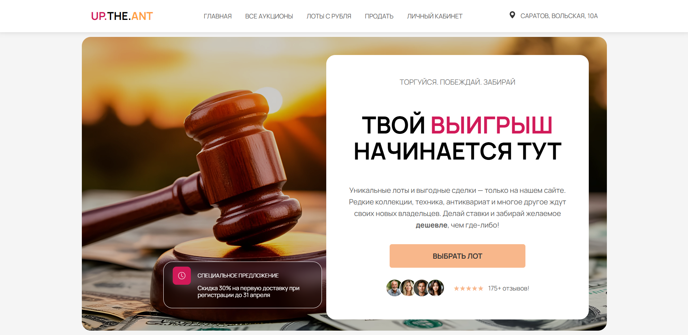
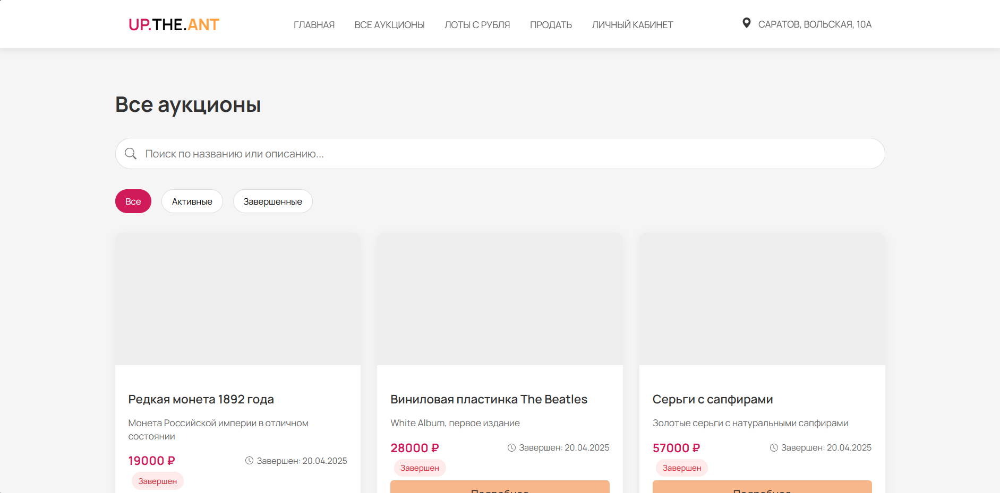
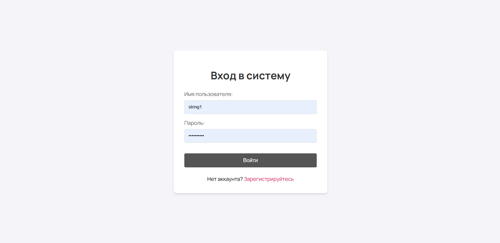
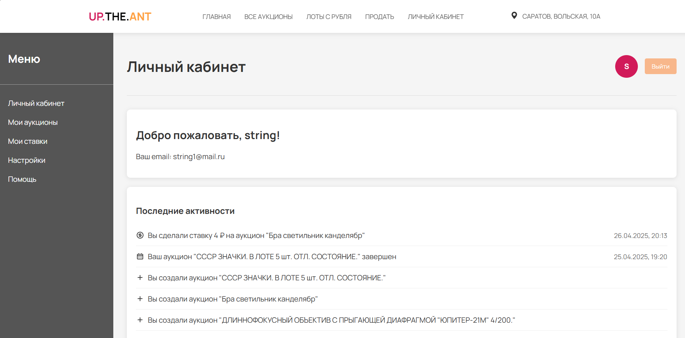
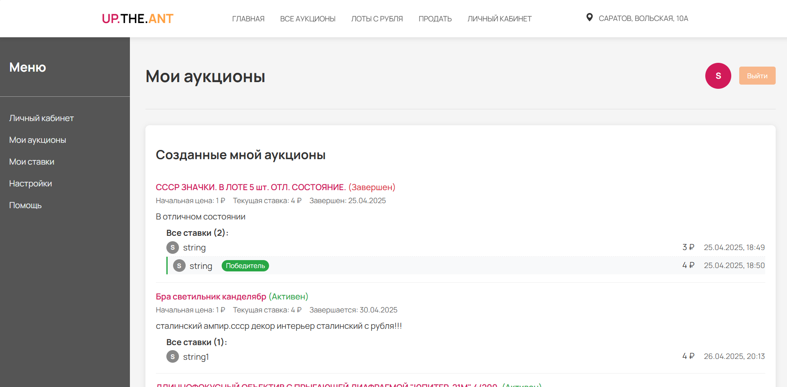
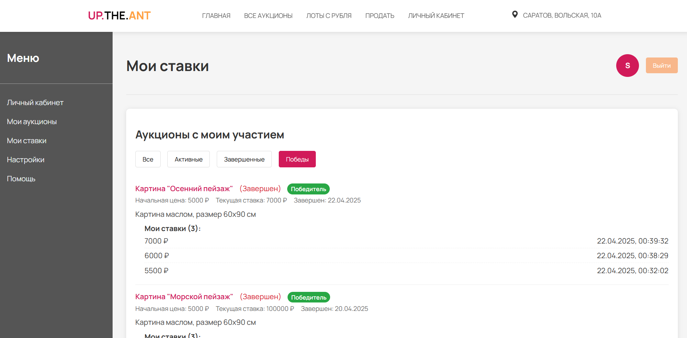
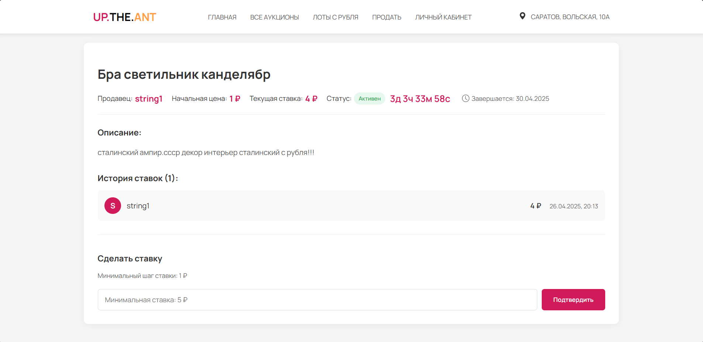

# UpTheAnt - Аукционная платформа

**UpTheAnt** — это платформа для проведения аукционов, где каждый пользователь может как создавать аукционы, так и участвовать в них. Все аукционы имеют историю ставок, и пользователи могут просматривать все изменения ставок до завершения аукциона.

---

## О проекте

Проект находится в активной разработке. На данный момент реализованы следующие функции:

- Подключение к базе данных.
- Реализованы интерфейсы и реализация сервисов.
- Реализация DTO (Data Transfer Objects) для передачи данных между слоями приложения.
- Написаны UNIT-тесты для сервисов и контроллеров.
- Реализованы интеграционные тесты для проверки работы API.
- Полноценная аутентификация через JWT-токены.
- Динамический интерфейс с таймером аукционов.
- Экспорт данных в CSV.
- Личный кабинет с историей участия.

---

## Технологии

- **Язык программирования**: Java 17
- **Фреймворк**: Spring Boot 3.4.3
- **База данных**: PostgreSQL, Hibernate
- **Миграции БД**: Liquibase 4.25
- **Безопасность**: Spring Security, JWT 0.11.5
- **Документация**: SpringDoc OpenAPI 2.5.0
- **Логирование**: SLF4J, Spring Boot Logging
- **Тестирование**:
  - UNIT-тесты: JUnit 5, Mockito
  - Интеграционные тесты: Spring Boot Test, MockMvc
- **DTO**: Использование DTO для передачи данных между слоями приложения.
- **Frontend**: JavaScript, Thymeleaf, Адаптивный дизайн

## Структура проекта

```plaintext
uptheant/
├───src/
│   ├───main/
│   │   ├───java/
│   │   │   └───com/uptheant/demo
│   │   │       ├───config/                        # Конфигурации Spring
│   │   │       ├───controller/                    # MVC и REST контроллеры
│   │   │       ├───dto/                           # Data Transfer Objects
│   │   │       ├───exception/                     # Обработчики ошибок
│   │   │       ├───model/                         # Сущности БД
│   │   │       ├───repository/                    # Работа с БД
│   │   │       ├───scheduler/                     # Бизнес-логика откртытия и закрытия ацукионов
│   │   │       ├───service/                       # Бизнес-логика
│   │   │       └───DemoApplication.java           # Главный класс запуска Spring Boot приложения
│   │   └───resources/
|   |       |───db/changelog                       # Настройки миграции Liquibase
│   │       ├───static/images                      # Изображения
│   │       ├───templates/                         # HTML страницы
│   │       └───application.properties             # Конфигурация
│   └───test/                                      # Тесты с собсвтенным окружением
```

## Интерфейс приложения


*Главная страница*


*Страница всех аукционов*


*Аутентификация*


*Личный кабинет*


*Страница моих аукционов*


*Страница моих ставок*


*Страница активного аукциона*

---

## Установка и запуск

> **Примечание**: На данный момент установка и запуск проекта невозможны, так как проект находится в стадии активной разработки.

### Предварительные требования

- Установите Java 17 или выше.
- Установите PostgreSQL.
- Убедитесь, что Maven установлен для сборки проекта.

---

## Контакты

- Если у вас есть вопросы или предложения, свяжитесь со мной:
- **Email**: <rinovech@yandex.ru>
- **GitHub**: rinovech
